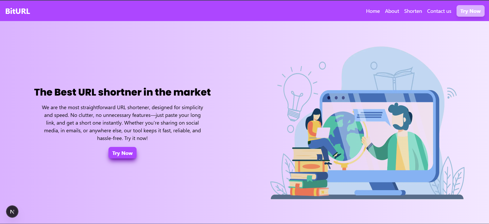
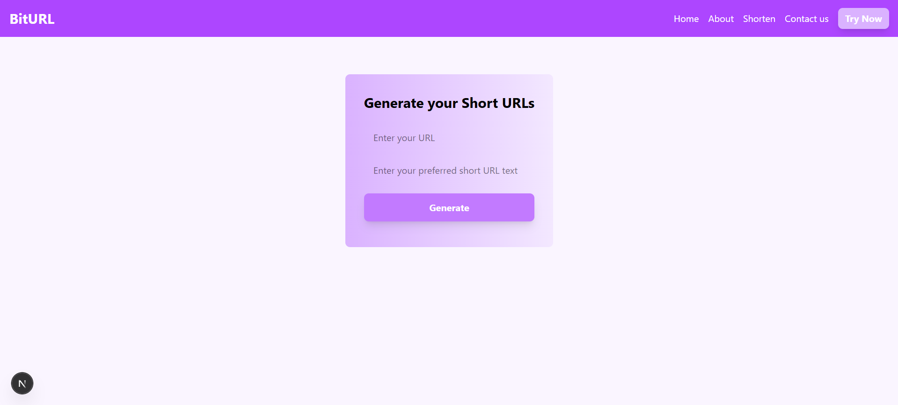

# 🌐 BitURL - Your Trusted URL Shortener 

**BitURL** is a sleek, full-stack URL shortener built with **Next.js (App Router)** and **MongoDB**. It offers a seamless user experience with a modern, responsive UI, fast redirection, and zero clutter. Whether you're sharing links on social media, emails, or anywhere else, BitURL gets the job done — instantly.

---

## 🚀 Features

- 🔗 **Shorten long URLs** into clean, minimal links
- ⚡ **Instant redirect** via Next.js API routes
- 💾 **MongoDB integration** for persistent link storage
- 📱 **Responsive UI** with Tailwind CSS
- 🎨 **Custom fonts** using Google + local font integration
- 🔒 Designed with simplicity, speed, and usability in mind

---

## 🛠️ Tech Stack

| Layer        | Technology            |
|--------------|------------------------|
| Frontend     | Next.js (App Router), Tailwind CSS |
| Backend      | Next.js API Routes     |
| Database     | MongoDB (via Atlas)    |
| Fonts        | Poppins (local), Geist (Google Fonts) |
| Hosting      | Vercel   |

---

## 📸 Screenshots

> Homepage  

> Shorten Page  

---

## 📁 Project Structure

/app
  ├── /api/shorten/route.js       → API to handle POST requests for shortening
  ├── /page.js                    → Homepage
  ├── /shorten/page.js            → URL shortener interface
/components
  └── Navbar.js                   → Responsive navigation bar
/fonts
  └── Poppins.ttf                 → Local font file
/lib
  └── mongodb.js                  → MongoDB connection using clientPromise
/public
  └── vector.jpg                  → Homepage illustration
  └── screenshot-homepage.png     → (optional) homepage screenshot

